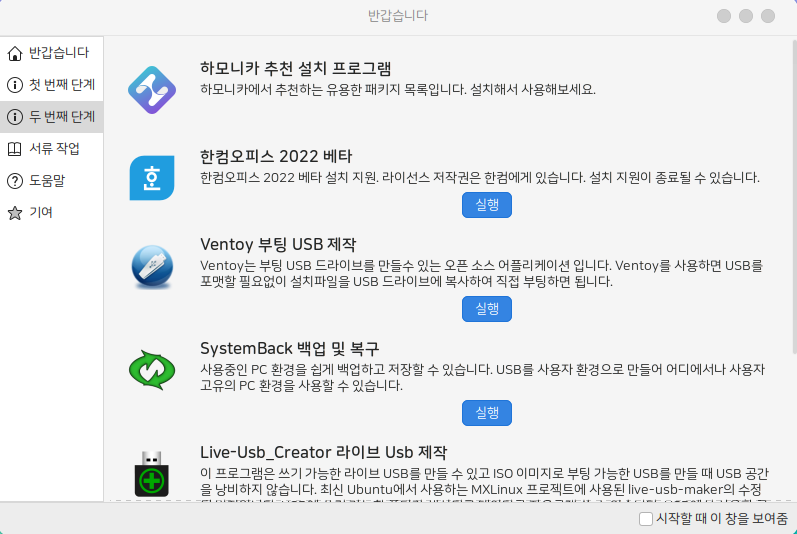

# Hamonikr Welcome screen

## 하모니카를 소개하는 프로그램

 * 리눅스 민트 웰컴을 하모니카 웰컴으로 변경하는 패키지 입니다.(replace)
 * 하모니카를 소개하면서 간단한 초기 설정을 할 수 있는 프로그램 입니다.  
 * 하모니카에서 제공하는 테마를 선택하여 사용하실 수 있습니다.  
 * 하단에 패널이 있고 기존에 윈도우를 사용하던 방식이 익숙하다면 전통적인 테마를 설정하고  
 * 유려한 디자인의 새로운 방식을 원한다면 현대적인 테마를 선택해보세요.




# Install
```
sudo apt update
sudo apt install hamonikr-welcome
```

# Usage
 * 하모니카가 처음 설치되었을 때 자동으로 보여주는 화면입니다.
 * '시작할 때 이 창을 보여줌'을 체크 해제 하였다면 시작메뉴에서 '환영합니다'를 클릭하면 됩니다.

# 이슈 또는 버그
사용 중 문제를 발견하시면 root@hamonikr.org 또는 https://groups.google.com/forum/m/#!forum/hamonikr 에서 알려주세요.
